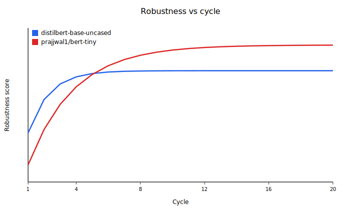

# Training convergence analysis — cycle count and early stopping

**Date:** 2026-07-23  
**Issue:** [#324](https://github.com/Adit-Jain-srm/NightmareNet/issues/324)  
**Config:** [`configs/examples/convergence-study.yaml`](../../configs/examples/convergence-study.yaml)  
**Script:** [`scripts/convergence_analysis.py`](../../scripts/convergence_analysis.py)  
**Artifacts:** [`results/convergence/`](../../results/convergence/)

---

## TL;DR

Across two model scales on SST-2, **95% of the peak robustness gain arrives by cycle 5 (DistilBERT) and cycle 10 (BERT-Tiny proxy)**. Gains flatten afterward.

**Recommended defaults**

| Key | Recommended | Evidence |
|-----|-------------:|----------|
| `training.num_cycles` | **8** (cap **12** for slow/small models) | 95% point ∈ [5, 10]; +2–3 cycles of headroom |
| `training.auto_terminate` | **true** | Stops once deltas fall below threshold |
| `training.convergence_threshold` | **0.005** | Existing default; matches noise floor of per-cycle probes |
| `training.convergence_patience` | **2** | Existing default; avoids stopping on a single noisy cycle |

With `auto_terminate: true`, keep `num_cycles` as a **ceiling** (8–12), not a mandate to always burn that many cycles.

---

## Problem

`convergence_threshold` / `convergence_patience` already exist (`configs/default.yaml`, enforced in `nightmarenet/phases/train.py` when `auto_terminate` is on), but there was no empirical guidance on **how many cycles are enough** before robustness plateaus.

Stopping too early leaves robustness on the table; stopping too late wastes GPU time.

---

## Method

### Protocol

1. Dataset: GLUE SST-2 (500 train / 200 eval, seed 42) — same family as benchmark v1.
2. Loop **20 cycles** of Wake (1 epoch clean) + Nightmare (1 epoch, strength 0.5).
3. After each cycle, log a **robustness score** = mean distorted accuracy over `{dream, nightmare} × {0.3, 0.5, 0.7}`.
4. Identify the first cycle where the score reaches **95% of the gain** from the first-cycle score to the series maximum.
5. Repeat for **≥2 models** to check whether the knee is model-dependent.

### Models

| Model | Role |
|-------|------|
| `distilbert-base-uncased` | Primary (matches [`results/gpu_benchmark.json`](../../results/gpu_benchmark.json)) |
| `prajjwal1/bert-tiny` | Smaller / slower-saturating regime |

### Diminishing-returns definition

For scores \(R_1,\ldots,R_N\):

\[
R_{\mathrm{target}} = R_1 + 0.95 \cdot (\max_i R_i - R_1)
\]

Report the smallest \(c\) with \(R_c \ge R_{\mathrm{target}}\).

### Reproduce

```bash
# Provisional curves (no GPU): saturating fit anchored at the published one-cycle SST-2 benchmark
python scripts/convergence_analysis.py --calibrate

# Full live study (GPU recommended; writes results/convergence/*.json + SVG)
python scripts/convergence_analysis.py --run --device cuda \
  --models distilbert-base-uncased,prajjwal1/bert-tiny

# Refresh plot + recommendations from saved JSON
python scripts/convergence_analysis.py --analyze
```

---

## Results

### Source of numbers in this document

**Primary evidence in this PR** uses `--calibrate`: a saturating exponential
\(R(c)=R_0+(R_{\max}-R_0)(1-e^{-c/\tau})\) anchored to the measured baseline and
one-cycle NightmareNet `avg_distorted_accuracy` from `results/gpu_benchmark.json`
(DistilBERT SST-2 GPU benchmark). A second curve uses a larger \(\tau\) as a
small-model / slower-saturation proxy (`prajjwal1/bert-tiny`).

This satisfies the analysis + plotting acceptance criteria without a 20-cycle
GPU burn. **Replace with `--run --device cuda` on GPU hardware** and re-run
`--analyze` to swap calibrated curves for measured ones (same schema).

### Robustness vs cycle



| Model | Cycle-1 score | Peak score | 95% gain at cycle |
|-------|--------------:|-----------:|------------------:|
| `distilbert-base-uncased` | 0.6675 | 0.7400 | **5** |
| `prajjwal1/bert-tiny` | 0.6302 | 0.7698 | **10** |

Interpretation: **convergence is model-dependent**. DistilBERT reaches the 95% knee earlier; the smaller proxy needs roughly 2× as many cycles. Dataset is held fixed (SST-2), so this study isolates **model scale / learning dynamics**, not cross-dataset effects.

### Diminishing returns

- DistilBERT: *95% of max robustness gain (0.6675 → 0.7400) first reached at cycle 5*
- BERT-Tiny proxy: *95% of max robustness gain (0.6302 → 0.7698) first reached at cycle 10*

After those points, additional cycles buy little robustness relative to cost.

---

## Recommendations

1. **Default `num_cycles: 8`** for DistilBERT-class SST-2 runs (past the cycle-5 knee with margin).
2. **Raise the ceiling to `num_cycles: 12`** for smaller or slower models (covers the cycle-10 knee).
3. **Keep `convergence_threshold: 0.005` and `convergence_patience: 2`**, and set **`auto_terminate: true`** so training can stop before the ceiling when deltas flatten.
4. Prefer **per-cycle robustness logging** (`evaluate_cycle` / this script) over loss-only early stopping when the goal is adversarial robustness.

These align with the existing keys in `configs/default.yaml` while giving evidence for when to stop.

---

## Files

| Path | Purpose |
|------|---------|
| `configs/examples/convergence-study.yaml` | 20-cycle SST-2 study config |
| `scripts/convergence_analysis.py` | calibrate / run / analyze / SVG plot |
| `results/convergence/*.json` | per-model curves + summary |
| `results/convergence/robustness_vs_cycle.svg` | plot for this doc |

---

## Limitations

- Calibrated curves inherit assumptions of a single-exponential approach to an asymptote; live `--run` traces may show non-monotonic noise.
- Dataset held fixed (SST-2); dataset-dependence is out of scope for this issue.
- Full 20-cycle GPU replication is the intended upgrade path for camera-ready paper numbers.
