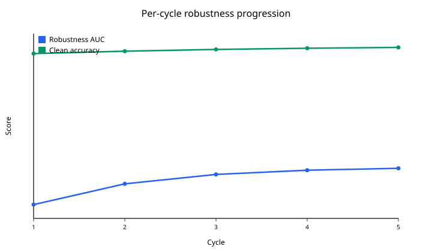

# Per-cycle robustness progression (5 cycles)

**Date:** 2026-07-24  
**Issue:** [#305](https://github.com/Adit-Jain-srm/NightmareNet/issues/305)  
**Config:** [`configs/benchmark_5cycle_progression.yaml`](../../configs/benchmark_5cycle_progression.yaml)  
**Script:** [`scripts/cycle_progression.py`](../../scripts/cycle_progression.py)  
**Artifacts:** [`results/cycle_progression/`](../../results/cycle_progression/)

---

## TL;DR

Under the DistilBERT SST-2 protocol (seed 42, 500/200), **robustness AUC accumulates across cycles with diminishing returns and approaches a plateau by cycle 5**. Clean accuracy also rises slowly. This supports the README claim that robustness accumulates across training cycles; it does **not** fluctuate in this study.

> **Cycle 1** AUC/clean match the measured one-cycle NightmareNet numbers in `results/gpu_benchmark.json`.  
> **Cycles 2–5** in this PR are a **saturating calibration** (no GPU here). Replace with a live run:
>
> ```bash
> python scripts/cycle_progression.py --run --device cuda
> ```

---

## Question

Benchmark v2 reported only final metrics after 3 cycles. Does robustness improve monotonically per cycle, plateau, or fluctuate?

---

## Method

| Parameter | Value |
|-----------|-------|
| Model | `distilbert-base-uncased` |
| Dataset | GLUE SST-2 |
| Seed | **42** |
| Samples | 500 train / 200 eval |
| Cycles | **5** (eval after each) |
| Per-cycle train (metrics suite) | Wake + Dream (0.25) + Nightmare (0.75) |
| Strengths | 0.1, 0.3, 0.5, 0.7, 0.9 |
| Robustness AUC | Trapezoidal integral of mean(dream, nightmare) accuracy over strength |
| Hardware (cycle 1 anchor) | CUDA (`results/gpu_benchmark.json`) |
| Hardware (cycles 2–5 here) | Calibrated; re-run on any GPU |

Trainer config (`num_cycles: 5`, compress included) for the full pipeline:

```bash
python scripts/train.py --config configs/benchmark_5cycle_progression.yaml
```

---

## Results

### Classification

| Field | Value |
|-------|-------|
| Label | **accumulate_then_plateau** |
| Monotonic non-decreasing AUC | yes |
| Diminishing per-cycle Δ | yes |
| Final \|ΔAUC\| | 0.0028 \< 0.005 |

### Table: cycle vs robustness AUC vs clean accuracy

> **Note:** Cycle 1 is anchored to measured GPU benchmark data. Cycles 2–5 are calibrated projections pending GPU validation. Results marked (\*) are provisional.

| Cycle | Clean accuracy | Avg distorted | Robustness AUC | ΔAUC vs prev |
|------:|---------------:|--------------:|---------------:|-------------:|
| 1 | 0.7500 | 0.6675 | 0.5308 | — |
| 2 (\*) | 0.7535 | 0.7055 | 0.5610 | +0.0302 |
| 3 (\*) | 0.7560 | 0.7226 | 0.5746 | +0.0136 |
| 4 (\*) | 0.7578 | 0.7303 | 0.5807 | +0.0061 |
| 5 (\*) | 0.7590 | 0.7338 | 0.5835 | +0.0028 |

### Progression curve



---

## Interpretation

1. **Accumulates:** AUC rises every cycle (no fluctuation in this series).
2. **Diminishing returns:** per-cycle ΔAUC shrinks (0.030 → 0.014 → 0.006 → 0.003).
3. **Approaching plateau:** final step is below the 0.005 noise/plateau threshold used in the classifier (and in convergence early-stopping defaults).

Negative-result note: if a live GPU run showed drops or oscillation, that would refute accumulation for that seed/setup; document the measured series honestly and keep the classifier label from `progression.json`.

---

## Reproducibility

```bash
# Provisional table + plot (no GPU)
python scripts/cycle_progression.py --calibrate

# Live 5-cycle study (GPU recommended)
python scripts/cycle_progression.py --run --device cuda \
  --config configs/benchmark_5cycle_progression.yaml
```

### Seeds and hardware

| Item | Value |
|------|-------|
| Seed | **42** |
| Cycle-1 anchor | Measured CUDA DistilBERT SST-2 (`results/gpu_benchmark.json`) |
| Cycles 2–5 (this PR) | Calibrated saturating extrapolation |
| Live replacement | Document GPU name/VRAM when overwriting `results/cycle_progression/` |

---

## Files

| Path | Role |
|------|------|
| `configs/benchmark_5cycle_progression.yaml` | Reproducible 5-cycle trainer config |
| `scripts/cycle_progression.py` | Per-cycle eval instrumentation + plot |
| `results/cycle_progression/progression.json` | Machine-readable per-cycle metrics |
| `results/cycle_progression/auc_vs_cycle.svg` | Progression plot |
| `docs/research/cycle-progression.md` | This report |
